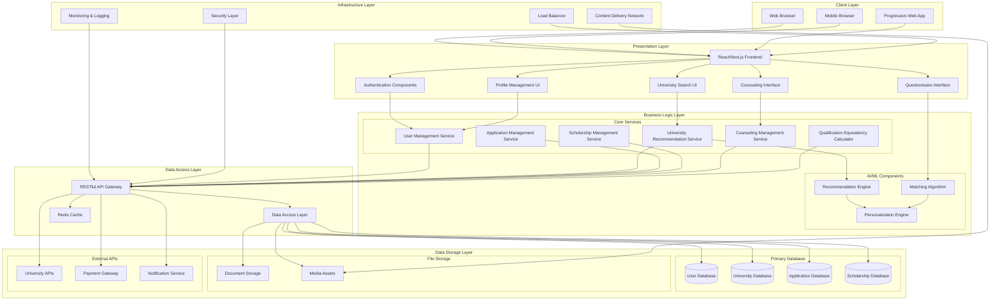
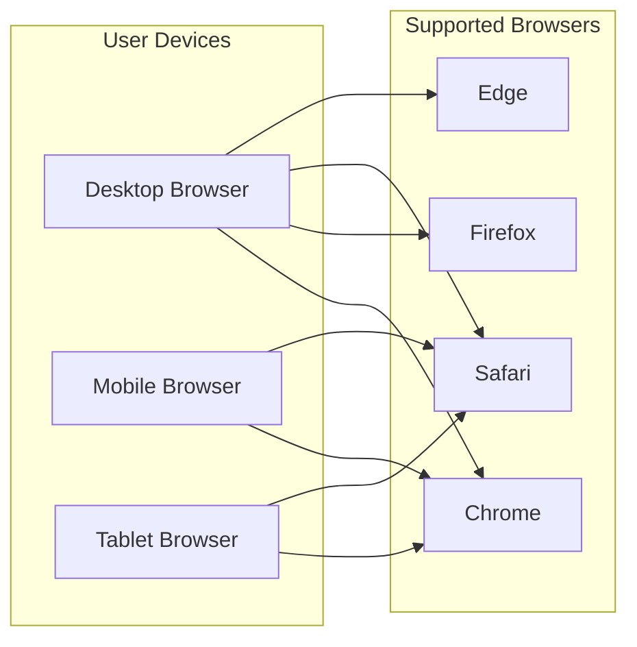
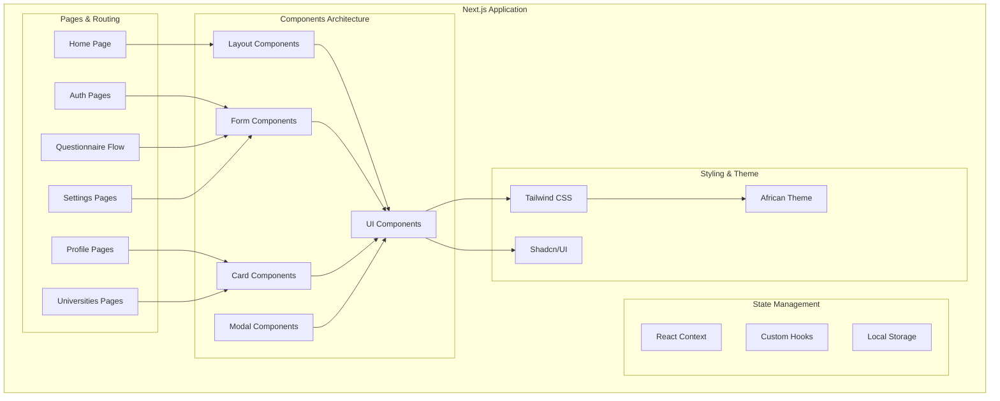
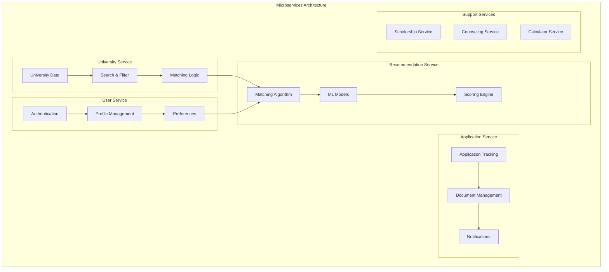
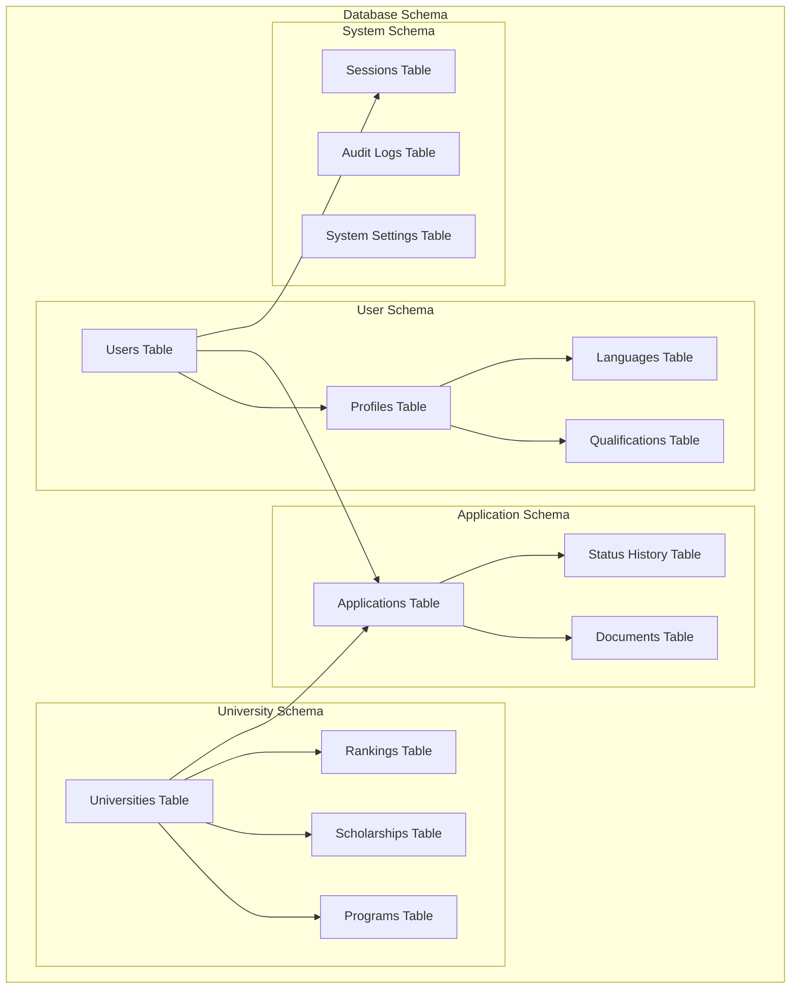
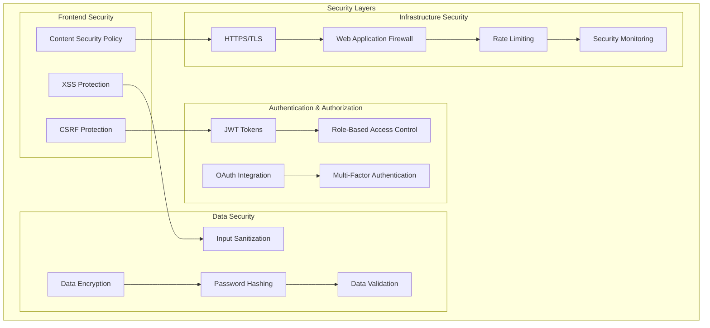
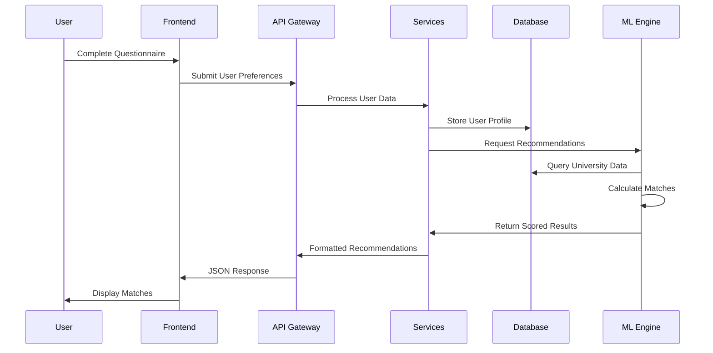

# EduConnect Africa - System Architecture

## High-Level System Architecture

## Detailed Architecture Components

### 1. Client Layer

### 2. Frontend Architecture (Next.js)

### 3. Backend Services Architecture

### 4. Database Architecture

### 5. Security Architecture

### 6. Data Flow Architecture

## Technology Stack

### Frontend Stack
- **Framework**: Next.js 15 with App Router
- **Language**: TypeScript
- **Styling**: Tailwind CSS + Shadcn/UI
- **State Management**: React Context + Custom Hooks
- **Build Tool**: Turbopack
- **Package Manager**: Bun

### Backend Stack (Future Implementation)
- **Runtime**: Node.js / Bun
- **Framework**: Express.js / Fastify
- **Database**: PostgreSQL (Primary) + Redis (Cache)
- **ORM**: Prisma / DrizzleORM
- **Authentication**: JWT + OAuth
- **File Storage**: AWS S3 / Cloudinary

### DevOps & Infrastructure
- **Deployment**: Vercel / Netlify (Frontend), AWS/DigitalOcean (Backend)
- **CDN**: Cloudflare / AWS CloudFront
- **Monitoring**: Sentry, LogRocket
- **CI/CD**: GitHub Actions
- **Version Control**: Git + GitHub

## Scalability Considerations

### Horizontal Scaling
- Microservices architecture for independent scaling
- Load balancing for traffic distribution
- Database sharding for large datasets
- CDN for global content delivery

### Performance Optimization
- Server-side rendering with Next.js
- Image optimization and lazy loading
- API response caching with Redis
- Database query optimization

### Monitoring & Analytics
- Real-time performance monitoring
- User behavior analytics
- Error tracking and reporting
- System health dashboards

This architecture provides a robust, scalable foundation for the EduConnect Africa platform, supporting current needs while allowing for future growth and feature expansion.
