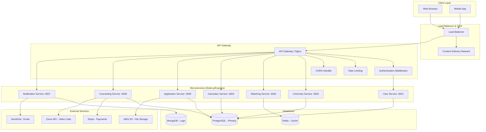

# EduConnect Africa - Backend Architecture Explanation

## 🚨 **Current State: Frontend-Only Implementation**

### **What We Have Now**

The current EduConnect Africa application is a **pure frontend application** built with:

**Technology Stack:**
```
Frontend: Next.js 15 + TypeScript + Tailwind CSS + shadcn/ui
Package Manager: Bun
Runtime: Node.js (for Next.js)
Data Storage: LocalStorage (browser)
Authentication: Mock authentication with localStorage
```

**Data Sources:**
- **Mock Data**: All universities, users, and content are hardcoded
- **LocalStorage**: User sessions and profile data
- **No Database**: No persistent server-side storage
- **No APIs**: No backend endpoints or services

**Current File Structure:**
```
educonnect-africa/
├── src/
│   ├── app/                    # Next.js 15 App Router
│   │   ├── (auth)/            # Authentication routes
│   │   ├── admin/             # Admin dashboard routes
│   │   ├── calculator/        # Grade calculator routes
│   │   ├── profile/           # Profile management routes
│   │   └── universities/      # University browsing routes
│   ├── components/            # React components
│   │   ├── calculator/        # Calculator-specific components
│   │   ├── profile/           # Profile-specific components
│   │   ├── ui/               # Reusable UI components (shadcn/ui)
│   │   └── layout/           # Layout components
│   ├── lib/
│   │   ├── context/          # React Context (AuthContext, AdminContext)
│   │   ├── data/             # Mock data (universities.ts)
│   │   ├── types/            # TypeScript type definitions
│   │   └── utils.ts          # Utility functions
│   └── hooks/                # Custom React hooks
├── public/                   # Static assets
└── package.json             # Dependencies and scripts
```

**Authentication Flow (Current):**
```typescript
// Mock authentication in AuthContext.tsx
const login = (email: string, password: string) => {
  // Creates a mock user object
  const mockUser = {
    id: "mock-user-id",
    email: email,
    firstName: "Demo",
    lastName: "User",
    // ... more mock properties
  };

  // Stores in localStorage
  setUser(mockUser);
  localStorage.setItem("educonnect_user", JSON.stringify(mockUser));
};
```

**Data Management (Current):**
```typescript
// Mock universities data in src/lib/data/universities.ts
export const sampleUniversities = [
  {
    id: "univ-001",
    name: "University of Cape Town",
    country: "South Africa",
    // ... hardcoded university data
  }
];

// All data is static - no database queries
```

---

## 🏗️ **Planned Backend Architecture**

### **Full-Stack Architecture Overview**



### **Microservices Architecture**

#### **1. User Service (Port 3001)**
```javascript
// Handles user management, authentication, profiles
const userService = {
  endpoints: [
    'POST /api/auth/register',
    'POST /api/auth/login',
    'POST /api/auth/logout',
    'GET /api/users/profile',
    'PUT /api/users/profile',
    'POST /api/users/verify-email',
    'POST /api/users/reset-password'
  ],
  database: 'PostgreSQL',
  responsibilities: [
    'User registration and authentication',
    'Profile management',
    'Email verification',
    'Password reset',
    'User preferences'
  ]
};
```

#### **2. University Service (Port 3002)**
```javascript
// Manages university data, programs, scholarships
const universityService = {
  endpoints: [
    'GET /api/universities',
    'GET /api/universities/:id',
    'GET /api/universities/search',
    'GET /api/programs',
    'GET /api/scholarships',
    'POST /api/admin/universities',
    'PUT /api/admin/universities/:id'
  ],
  database: 'PostgreSQL',
  responsibilities: [
    'University catalog management',
    'Program and scholarship data',
    'Search and filtering',
    'Admin university management'
  ]
};
```

#### **3. Matching Service (Port 3003)**
```javascript
// AI-powered university recommendations
const matchingService = {
  endpoints: [
    'POST /api/matching/calculate',
    'GET /api/matching/recommendations/:userId',
    'POST /api/matching/questionnaire',
    'GET /api/matching/factors'
  ],
  database: 'Redis (caching), PostgreSQL (results)',
  responsibilities: [
    'University matching algorithm',
    'Personalized recommendations',
    'Questionnaire processing',
    'Match score calculations'
  ]
};
```

#### **4. Calculator Service (Port 3004)**
```javascript
// Grade equivalency calculations
const calculatorService = {
  endpoints: [
    'POST /api/calculator/convert',
    'GET /api/calculator/countries',
    'GET /api/calculator/guidelines/:country',
    'POST /api/calculator/save-result',
    'GET /api/calculator/history/:userId',
    'POST /api/calculator/generate-pdf'
  ],
  database: 'PostgreSQL',
  responsibilities: [
    'Grade conversion algorithms',
    'Country-specific rules',
    'PDF report generation',
    'Calculation history'
  ]
};
```

#### **5. Application Service (Port 3005)**
```javascript
// Application tracking and document management
const applicationService = {
  endpoints: [
    'POST /api/applications',
    'GET /api/applications/:userId',
    'PUT /api/applications/:id/status',
    'POST /api/applications/:id/documents',
    'GET /api/applications/:id/timeline'
  ],
  database: 'PostgreSQL',
  fileStorage: 'AWS S3',
  responsibilities: [
    'Application lifecycle management',
    'Document upload and storage',
    'Status tracking',
    'Timeline management'
  ]
};
```

#### **6. Counseling Service (Port 3006)**
```javascript
// Counseling sessions and payments
const counselingService = {
  endpoints: [
    'GET /api/counselors',
    'POST /api/sessions/book',
    'GET /api/sessions/:userId',
    'POST /api/sessions/:id/feedback',
    'POST /api/payments/process'
  ],
  database: 'PostgreSQL',
  integrations: ['Stripe', 'Zoom API'],
  responsibilities: [
    'Counselor management',
    'Session booking and scheduling',
    'Payment processing',
    'Video call integration'
  ]
};
```

#### **7. Notification Service (Port 3007)**
```javascript
// Email, SMS, and push notifications
const notificationService = {
  endpoints: [
    'POST /api/notifications/email',
    'POST /api/notifications/sms',
    'GET /api/notifications/:userId',
    'POST /api/notifications/preferences'
  ],
  database: 'MongoDB (logs)',
  integrations: ['SendGrid', 'Twilio'],
  responsibilities: [
    'Email notifications',
    'SMS alerts',
    'Notification preferences',
    'Delivery tracking'
  ]
};
```

### **Database Schema (PostgreSQL)**

#### **Core Tables Structure:**
```sql
-- Users table
CREATE TABLE users (
    id UUID PRIMARY KEY DEFAULT gen_random_uuid(),
    email VARCHAR(255) UNIQUE NOT NULL,
    password_hash VARCHAR(255) NOT NULL,
    first_name VARCHAR(100) NOT NULL,
    last_name VARCHAR(100) NOT NULL,
    phone_number VARCHAR(20),
    date_of_birth DATE,
    gender VARCHAR(20),
    nationality VARCHAR(100),
    state VARCHAR(100),
    city VARCHAR(100),
    verified BOOLEAN DEFAULT FALSE,
    role VARCHAR(20) DEFAULT 'STUDENT',
    profile_picture_url TEXT,
    created_at TIMESTAMP DEFAULT NOW(),
    updated_at TIMESTAMP DEFAULT NOW()
);

-- University table
CREATE TABLE universities (
    id UUID PRIMARY KEY DEFAULT gen_random_uuid(),
    name VARCHAR(255) NOT NULL,
    country VARCHAR(100) NOT NULL,
    city VARCHAR(100) NOT NULL,
    logo_url TEXT,
    description TEXT,
    website VARCHAR(255),
    founded_year INTEGER,
    type VARCHAR(50),
    ranking VARCHAR(10),
    students_count INTEGER,
    nigerian_students_count INTEGER,
    acceptance_rate DECIMAL(3,2),
    average_tuition DECIMAL(10,2),
    tuition_range JSONB,
    contact_info JSONB,
    created_at TIMESTAMP DEFAULT NOW(),
    updated_at TIMESTAMP DEFAULT NOW()
);

-- User profiles table
CREATE TABLE user_profiles (
    id UUID PRIMARY KEY DEFAULT gen_random_uuid(),
    user_id UUID REFERENCES users(id),
    bio TEXT,
    study_preferences JSONB,
    completion_percentage INTEGER DEFAULT 0,
    updated_at TIMESTAMP DEFAULT NOW()
);

-- Qualifications table
CREATE TABLE qualifications (
    id UUID PRIMARY KEY DEFAULT gen_random_uuid(),
    user_id UUID REFERENCES users(id),
    type VARCHAR(50) NOT NULL,
    institution VARCHAR(255),
    year_completed INTEGER,
    subjects_grades JSONB,
    certificate_url TEXT,
    created_at TIMESTAMP DEFAULT NOW()
);

-- Calculator results table
CREATE TABLE calculator_results (
    id UUID PRIMARY KEY DEFAULT gen_random_uuid(),
    user_id UUID REFERENCES users(id),
    target_country VARCHAR(50) NOT NULL,
    qualification_type VARCHAR(50) NOT NULL,
    qualification_year INTEGER NOT NULL,
    input_grades JSONB NOT NULL,
    converted_grades JSONB NOT NULL,
    eligibility_result JSONB NOT NULL,
    created_at TIMESTAMP DEFAULT NOW()
);

-- Applications table
CREATE TABLE applications (
    id UUID PRIMARY KEY DEFAULT gen_random_uuid(),
    user_id UUID REFERENCES users(id),
    university_id UUID REFERENCES universities(id),
    program_id UUID REFERENCES programs(id),
    status VARCHAR(50) DEFAULT 'PREPARING',
    application_date DATE,
    last_updated TIMESTAMP DEFAULT NOW(),
    notes TEXT,
    documents JSONB,
    timeline JSONB,
    created_at TIMESTAMP DEFAULT NOW()
);

-- Add indexes for performance
CREATE INDEX idx_users_email ON users(email);
CREATE INDEX idx_universities_country ON universities(country);
CREATE INDEX idx_applications_user_id ON applications(user_id);
CREATE INDEX idx_applications_status ON applications(status);
CREATE INDEX idx_calculator_results_user_id ON calculator_results(user_id);
```

### **API Architecture**

#### **RESTful API Design:**
```javascript
// API Gateway routing (Express.js)
const apiRoutes = {
  // Authentication routes
  'POST /api/auth/register': 'userService.register',
  'POST /api/auth/login': 'userService.login',
  'POST /api/auth/refresh': 'userService.refreshToken',

  // User management
  'GET /api/users/profile': 'userService.getProfile',
  'PUT /api/users/profile': 'userService.updateProfile',

  // Universities
  'GET /api/universities': 'universityService.getUniversities',
  'GET /api/universities/:id': 'universityService.getUniversity',
  'POST /api/universities/search': 'universityService.searchUniversities',

  // Grade Calculator
  'POST /api/calculator/convert': 'calculatorService.convertGrades',
  'GET /api/calculator/countries': 'calculatorService.getCountries',
  'POST /api/calculator/save-result': 'calculatorService.saveResult',

  // University Matching
  'POST /api/matching/calculate': 'matchingService.calculateMatches',
  'POST /api/matching/questionnaire': 'matchingService.processQuestionnaire',

  // Applications
  'POST /api/applications': 'applicationService.createApplication',
  'GET /api/applications/user/:userId': 'applicationService.getUserApplications',
  'PUT /api/applications/:id/status': 'applicationService.updateStatus',

  // Counseling
  'GET /api/counselors': 'counselingService.getCounselors',
  'POST /api/sessions/book': 'counselingService.bookSession',
  'POST /api/payments/process': 'counselingService.processPayment'
};
```

#### **Authentication & Security:**
```javascript
// JWT-based authentication
const authMiddleware = {
  generateToken: (userId, role) => {
    return jwt.sign(
      { userId, role },
      process.env.JWT_SECRET,
      { expiresIn: '24h' }
    );
  },

  verifyToken: (req, res, next) => {
    const token = req.headers.authorization?.replace('Bearer ', '');
    try {
      const decoded = jwt.verify(token, process.env.JWT_SECRET);
      req.user = decoded;
      next();
    } catch (error) {
      res.status(401).json({ error: 'Unauthorized' });
    }
  },

  requireRole: (role) => (req, res, next) => {
    if (req.user.role !== role) {
      return res.status(403).json({ error: 'Forbidden' });
    }
    next();
  }
};
```

### **Deployment Architecture**

#### **Production Environment:**
```yaml
# docker-compose.yml
version: '3.8'
services:
  # API Gateway
  nginx:
    image: nginx:alpine
    ports:
      - "80:80"
      - "443:443"
    volumes:
      - ./nginx.conf:/etc/nginx/nginx.conf

  # Frontend (Next.js)
  frontend:
    build: ./frontend
    ports:
      - "3000:3000"
    environment:
      - NODE_ENV=production
      - API_BASE_URL=http://api-gateway:8080

  # API Gateway
  api-gateway:
    build: ./api-gateway
    ports:
      - "8080:8080"
    environment:
      - NODE_ENV=production
      - JWT_SECRET=${JWT_SECRET}

  # Microservices
  user-service:
    build: ./services/user-service
    ports:
      - "3001:3001"
    environment:
      - DATABASE_URL=${DATABASE_URL}
      - REDIS_URL=${REDIS_URL}

  university-service:
    build: ./services/university-service
    ports:
      - "3002:3002"
    environment:
      - DATABASE_URL=${DATABASE_URL}

  calculator-service:
    build: ./services/calculator-service
    ports:
      - "3004:3004"
    environment:
      - DATABASE_URL=${DATABASE_URL}

  # Databases
  postgres:
    image: postgres:15
    environment:
      - POSTGRES_DB=educonnect
      - POSTGRES_USER=${DB_USER}
      - POSTGRES_PASSWORD=${DB_PASSWORD}
    volumes:
      - postgres_data:/var/lib/postgresql/data

  redis:
    image: redis:7-alpine
    ports:
      - "6379:6379"

  mongodb:
    image: mongo:6
    environment:
      - MONGO_INITDB_DATABASE=educonnect_logs
    volumes:
      - mongo_data:/data/db

volumes:
  postgres_data:
  mongo_data:
```

### **Migration Path: Frontend → Full-Stack**

#### **Phase 1: Basic Backend Setup**
1. Set up PostgreSQL database with core tables
2. Create User Service with authentication
3. Replace localStorage with real JWT tokens
4. Migrate university data from mock to database

#### **Phase 2: Core Services**
1. Implement University Service with search
2. Build Calculator Service with conversion algorithms
3. Add file upload capabilities for documents
4. Implement basic application tracking

#### **Phase 3: Advanced Features**
1. Build Matching Service with AI recommendations
2. Add Counseling Service with payment integration
3. Implement Notification Service
4. Add admin dashboard with real data management

#### **Phase 4: Production Optimization**
1. Add Redis caching for performance
2. Implement comprehensive logging and monitoring
3. Set up CI/CD pipelines
4. Add comprehensive testing suite

---

## 🎯 **Summary**

**Current State:**
- ✅ **Frontend-only** Next.js application
- ✅ **Mock data** and localStorage authentication
- ✅ **Full UI/UX** implemented with working calculator
- ❌ **No backend** services or database

**Planned Architecture:**
- 🏗️ **Microservices** architecture with 7 specialized services
- 🗄️ **PostgreSQL** for primary data, Redis for caching
- 🔒 **JWT authentication** with role-based access control
- 🚀 **Dockerized deployment** with load balancing
- 📊 **Comprehensive API** design with proper error handling

The current implementation serves as an **excellent prototype** and **MVP demonstration**, while the planned backend provides a **scalable, production-ready architecture** for handling real users and data.
