# EduConnect Africa - Frontend Architecture Explained

## 🎨 **Frontend Technology Stack**

### **Core Technologies**
```json
{
  "framework": "Next.js 15.2.0",
  "language": "TypeScript",
  "styling": "Tailwind CSS",
  "ui_library": "shadcn/ui + Radix UI",
  "package_manager": "Bun",
  "bundler": "Turbopack (Next.js 15)",
  "icons": "Lucide React",
  "state_management": "React Context + Hooks",
  "routing": "Next.js App Router",
  "forms": "React Hook Form + Zod validation"
}
```

### **Key Dependencies**
```javascript
const frontendStack = {
  // Core Framework
  "next": "^15.2.0",              // React framework with SSR/SSG
  "react": "^19.0.0",             // UI library
  "typescript": "^5.6.3",         // Type safety

  // Styling & UI
  "tailwindcss": "^3.4.17",      // Utility-first CSS
  "tailwindcss-animate": "^1.0.7", // Animations
  "class-variance-authority": "^0.7.1", // Component variants
  "clsx": "^2.1.1",              // Conditional classnames

  // UI Components (Radix UI)
  "@radix-ui/react-avatar": "^1.1.9",
  "@radix-ui/react-dialog": "^1.1.14",
  "@radix-ui/react-dropdown-menu": "^2.1.14",
  "@radix-ui/react-select": "^2.2.4",
  "@radix-ui/react-tabs": "^1.1.11",
  "@radix-ui/react-toast": "^1.2.13",
  // ... more Radix components

  // Icons & Assets
  "lucide-react": "^0.475.0",    // Icon library
  "embla-carousel-react": "^8.6.0", // Carousel component

  // Forms & Validation
  "react-hook-form": "^7.54.2",  // Form management
  "@hookform/resolvers": "^5.0.1", // Form validation
  "zod": "^3.24.1",              // Schema validation

  // Notifications
  "sonner": "^1.7.1"             // Toast notifications
};
```

---

## 📁 **File Structure & Organization**

### **Complete Project Structure**
```
educonnect-africa/
├── public/                          # Static assets
│   ├── images/                      # Images and logos
│   ├── favicon.ico                  # Site favicon
│   └── robots.txt                   # SEO robots file
│
├── src/                             # Source code
│   ├── app/                         # Next.js 15 App Router
│   │   ├── (auth)/                  # Auth route group
│   │   │   ├── signin/              # Sign in page
│   │   │   └── signup/              # Sign up page
│   │   ├── admin/                   # Admin dashboard
│   │   │   ├── dashboard/           # Admin dashboard page
│   │   │   ├── universities/        # University management
│   │   │   │   ├── new/            # Add new university
│   │   │   │   └── page.tsx        # Universities list
│   │   │   └── layout.tsx          # Admin layout
│   │   ├── calculator/              # Grade calculator
│   │   │   └── page.tsx            # Calculator main page
│   │   ├── counseling/              # Counseling services
│   │   │   └── page.tsx            # Counseling page
│   │   ├── profile/                 # User profile
│   │   │   ├── settings/           # Profile settings
│   │   │   │   └── page.tsx        # Settings page
│   │   │   └── page.tsx            # Profile page
│   │   ├── questionnaire/           # User questionnaire
│   │   │   ├── flow/               # Questionnaire flow
│   │   │   │   └── page.tsx        # Multi-step form
│   │   │   └── page.tsx            # Questionnaire start
│   │   ├── resources/               # Educational resources
│   │   │   └── page.tsx            # Resources page
│   │   ├── scholarships/            # Scholarships
│   │   │   └── page.tsx            # Scholarships page
│   │   ├── universities/            # University browsing
│   │   │   ├── [id]/               # Dynamic university details
│   │   │   │   └── page.tsx        # University detail page
│   │   │   └── page.tsx            # Universities list
│   │   ├── globals.css              # Global styles
│   │   ├── layout.tsx               # Root layout
│   │   ├── loading.tsx              # Global loading UI
│   │   ├── not-found.tsx            # 404 page
│   │   └── page.tsx                 # Homepage
│   │
│   ├── components/                  # React components
│   │   ├── admin/                   # Admin-specific components
│   │   │   ├── AdminDashboardStats.tsx
│   │   │   ├── AdminHeader.tsx
│   │   │   ├── AdminLayout.tsx
│   │   │   ├── AdminSidebar.tsx
│   │   │   ├── QuickActions.tsx
│   │   │   ├── RecentActivities.tsx
│   │   │   └── SystemMetrics.tsx
│   │   ├── calculator/              # Calculator components
│   │   │   ├── CalculatorIntro.tsx  # Calculator introduction
│   │   │   ├── CountrySelection.tsx # Country selection
│   │   │   ├── GradeInput.tsx       # Grade input form
│   │   │   └── GradeResults.tsx     # Results display
│   │   ├── common/                  # Shared/common components
│   │   │   ├── CallToAction.tsx     # CTA sections
│   │   │   ├── FeatureHighlights.tsx
│   │   │   ├── HeroSection.tsx      # Homepage hero
│   │   │   ├── HowItWorks.tsx       # Process explanation
│   │   │   └── Testimonials.tsx     # User testimonials
│   │   ├── counseling/              # Counseling components
│   │   │   ├── CounselingFAQ.tsx
│   │   │   ├── CounselingHeader.tsx
│   │   │   ├── CounselingInfo.tsx
│   │   │   └── CounselorList.tsx
│   │   ├── layout/                  # Layout components
│   │   │   ├── Footer.tsx           # Site footer
│   │   │   ├── Header.tsx           # Site header/navigation
│   │   │   └── MainLayout.tsx       # Main page layout
│   │   ├── profile/                 # Profile components
│   │   │   ├── ProfileHeader.tsx    # Profile header with avatar
│   │   │   ├── ProfileStats.tsx     # Profile statistics
│   │   │   ├── ProfileTabs.tsx      # Tab navigation
│   │   │   ├── ProfileOverview.tsx  # Overview tab content
│   │   │   ├── AcademicInfo.tsx     # Academic information
│   │   │   ├── StudyPreferences.tsx # Study preferences
│   │   │   ├── SavedUniversities.tsx# Saved universities
│   │   │   ├── ApplicationsTab.tsx  # Applications management
│   │   │   ├── CounselingSessionsTab.tsx # Counseling history
│   │   │   ├── SettingsHeader.tsx   # Settings page header
│   │   │   ├── SettingsTabs.tsx     # Settings tab navigation
│   │   │   ├── PersonalSettings.tsx # Personal info settings
│   │   │   ├── AcademicSettings.tsx # Academic settings
│   │   │   ├── PreferencesSettings.tsx # Preferences
│   │   │   └── AccountSettings.tsx  # Account & security
│   │   ├── questionnaire/           # Questionnaire components
│   │   │   ├── PersonalInfoStep.tsx # Step 1: Personal info
│   │   │   ├── AcademicBackgroundStep.tsx # Step 2: Academic
│   │   │   ├── StudyPreferencesStep.tsx # Step 3: Preferences
│   │   │   ├── BudgetStep.tsx       # Step 4: Budget
│   │   │   ├── LocationPreferencesStep.tsx # Step 5: Location
│   │   │   └── FinalStep.tsx        # Step 6: Review & submit
│   │   ├── ui/                      # shadcn/ui components
│   │   │   ├── button.tsx           # Button component
│   │   │   ├── card.tsx             # Card component
│   │   │   ├── input.tsx            # Input component
│   │   │   ├── select.tsx           # Select component
│   │   │   ├── dialog.tsx           # Dialog/modal component
│   │   │   ├── tabs.tsx             # Tabs component
│   │   │   ├── badge.tsx            # Badge component
│   │   │   ├── avatar.tsx           # Avatar component
│   │   │   ├── progress.tsx         # Progress bar
│   │   │   ├── slider.tsx           # Slider component
│   │   │   ├── checkbox.tsx         # Checkbox component
│   │   │   ├── alert.tsx            # Alert component
│   │   │   ├── table.tsx            # Table component
│   │   │   ├── toast.tsx            # Toast notifications
│   │   │   └── switch.tsx           # Switch/toggle component
│   │   └── university/              # University components
│   │       ├── UniversityCard.tsx   # University card display
│   │       ├── UniversityFilters.tsx # Search filters
│   │       ├── PersonalizedUniversityCard.tsx # Matched universities
│   │       └── QuickQuestionnaireDialog.tsx # Quick questionnaire
│   │
│   ├── lib/                         # Utilities and configuration
│   │   ├── constants/               # App constants
│   │   │   └── colors.ts           # Color constants
│   │   ├── context/                # React Context providers
│   │   │   ├── AuthContext.tsx     # Authentication context
│   │   │   └── AdminContext.tsx    # Admin context
│   │   ├── data/                   # Mock data
│   │   │   └── universities.ts     # University sample data
│   │   ├── hooks/                  # Custom React hooks
│   │   ├── services/               # API service layer
│   │   ├── types/                  # TypeScript type definitions
│   │   │   ├── university.ts       # University types
│   │   │   └── user.ts            # User types
│   │   └── utils.ts               # Utility functions
│   │
│   └── hooks/                      # Global custom hooks
│       └── use-toast.ts           # Toast notification hook
│
├── .same/                          # Project documentation
│   ├── architecture.md            # System architecture
│   ├── backend-architecture.md    # Backend explanation
│   ├── frontend-architecture.md   # This file
│   ├── requirements.md            # Project requirements
│   ├── system-architecture-diagrams.md # UML diagrams
│   ├── todos.md                   # Project todos
│   └── uml-diagrams.md           # Additional UML diagrams
│
├── components.json                # shadcn/ui configuration
├── next.config.mjs               # Next.js configuration
├── package.json                  # Dependencies and scripts
├── tailwind.config.ts           # Tailwind CSS configuration
├── tsconfig.json                # TypeScript configuration
└── biome.json                   # Code linting configuration
```

---

## 🏗️ **Component Architecture**

### **Component Hierarchy**

```mermaid
graph TB
    subgraph "App Router Layout"
        RL[Root Layout]
        ML[Main Layout]
        AL[Admin Layout]
    end

    subgraph "Page Components"
        HP[Home Page]
        UP[Universities Page]
        CP[Calculator Page]
        PP[Profile Page]
        SP[Settings Page]
        QP[Questionnaire Page]
        ADP[Admin Dashboard]
    end

    subgraph "Layout Components"
        H[Header]
        F[Footer]
        AS[Admin Sidebar]
        AH[Admin Header]
    end

    subgraph "Feature Components"
        subgraph "University Features"
            UC[University Card]
            UF[University Filters]
            PUC[Personalized University Card]
            QQD[Quick Questionnaire Dialog]
        end

        subgraph "Calculator Features"
            CI[Calculator Intro]
            CS[Country Selection]
            GI[Grade Input]
            GR[Grade Results]
        end

        subgraph "Profile Features"
            PH[Profile Header]
            PT[Profile Tabs]
            PO[Profile Overview]
            AI[Academic Info]
            SU[Saved Universities]
            AT[Applications Tab]
        end

        subgraph "Settings Features"
            ST[Settings Tabs]
            PS[Personal Settings]
            AS_COMP[Academic Settings]
            PR[Preferences Settings]
            AC[Account Settings]
        end
    end

    subgraph "UI Components (shadcn/ui)"
        B[Button]
        C[Card]
        I[Input]
        S[Select]
        D[Dialog]
        T[Table]
        BD[Badge]
        AV[Avatar]
        PR_COMP[Progress]
        SL[Slider]
        CB[Checkbox]
        TAB[Tabs]
        AL_COMP[Alert]
    end

    RL --> ML
    RL --> AL
    ML --> H
    ML --> F
    AL --> AH
    AL --> AS

    HP --> ML
    UP --> ML
    CP --> ML
    PP --> ML
    SP --> ML
    QP --> ML
    ADP --> AL

    UP --> UC
    UP --> UF
    UP --> PUC
    UP --> QQD

    CP --> CI
    CP --> CS
    CP --> GI
    CP --> GR

    PP --> PH
    PP --> PT
    PT --> PO
    PT --> AI
    PT --> SU
    PT --> AT

    SP --> ST
    ST --> PS
    ST --> AS_COMP
    ST --> PR
    ST --> AC

    %% All feature components use UI components
    UC --> B
    UC --> C
    UC --> BD
    GI --> I
    GI --> S
    GI --> CB
    PH --> AV
    PH --> BD
```


### **Component Design Patterns**

#### **1. Compound Components Pattern**
```typescript
// Profile tabs using compound component pattern
export function ProfileTabs() {
  return (
    <Tabs defaultValue="overview" className="w-full">
      <TabsList className="grid w-full grid-cols-3 md:grid-cols-6">
        <TabsTrigger value="overview">Overview</TabsTrigger>
        <TabsTrigger value="academic">Academic</TabsTrigger>
        <TabsTrigger value="preferences">Preferences</TabsTrigger>
        <TabsTrigger value="saved">Saved</TabsTrigger>
        <TabsTrigger value="applications">Applications</TabsTrigger>
        <TabsTrigger value="counseling">Counseling</TabsTrigger>
      </TabsList>

      <TabsContent value="overview">
        <ProfileOverview />
      </TabsContent>

      <TabsContent value="academic">
        <AcademicInfo />
      </TabsContent>

      {/* More tab contents */}
    </Tabs>
  );
}
```

#### **2. Container/Presentational Pattern**
```typescript
// Container component (handles logic)
export function UniversitiesPage() {
  const [universities, setUniversities] = useState([]);
  const [filters, setFilters] = useState({});
  const [loading, setLoading] = useState(true);

  // Logic for fetching, filtering, etc.

  return (
    <MainLayout>
      <UniversityFilters filters={filters} onFiltersChange={setFilters} />
      <UniversityGrid universities={filteredUniversities} loading={loading} />
    </MainLayout>
  );
}

// Presentational component (pure UI)
export function UniversityGrid({ universities, loading }) {
  if (loading) return <UniversityGridSkeleton />;

  return (
    <div className="grid grid-cols-1 md:grid-cols-2 lg:grid-cols-3 gap-6">
      {universities.map(university => (
        <UniversityCard key={university.id} university={university} />
      ))}
    </div>
  );
}
```

#### **3. Custom Hook Pattern**
```typescript
// Custom hook for authentication logic
export function useAuth() {
  const context = useContext(AuthContext);
  if (!context) {
    throw new Error('useAuth must be used within AuthProvider');
  }
  return context;
}

// Custom hook for calculator logic
export function useCalculator() {
  const [country, setCountry] = useState<Country | null>(null);
  const [grades, setGrades] = useState<Grade[]>([]);
  const [results, setResults] = useState<ConversionResult | null>(null);

  const calculateEquivalency = useCallback(() => {
    // Calculation logic
  }, [country, grades]);

  return {
    country,
    setCountry,
    grades,
    setGrades,
    results,
    calculateEquivalency
  };
}
```

---

## 🛣️ **Routing Architecture (Next.js App Router)**

### **App Router Structure**
```typescript
// Next.js 15 App Router file-based routing
const routingStructure = {
  // Public routes
  '/': 'app/page.tsx',                    // Homepage
  '/universities': 'app/universities/page.tsx', // University listing
  '/universities/[id]': 'app/universities/[id]/page.tsx', // University details
  '/calculator': 'app/calculator/page.tsx', // Grade calculator
  '/counseling': 'app/counseling/page.tsx', // Counseling services
  '/scholarships': 'app/scholarships/page.tsx', // Scholarships
  '/resources': 'app/resources/page.tsx', // Educational resources

  // Authentication routes (grouped)
  '/signin': 'app/(auth)/signin/page.tsx',
  '/signup': 'app/(auth)/signup/page.tsx',

  // Protected user routes
  '/profile': 'app/profile/page.tsx',     // User profile
  '/profile/settings': 'app/profile/settings/page.tsx', // Settings
  '/questionnaire': 'app/questionnaire/page.tsx', // Questionnaire start
  '/questionnaire/flow': 'app/questionnaire/flow/page.tsx', // Multi-step form

  // Admin routes (protected)
  '/admin': 'app/admin/layout.tsx',       // Admin layout
  '/admin/dashboard': 'app/admin/dashboard/page.tsx', // Admin dashboard
  '/admin/universities': 'app/admin/universities/page.tsx', // Manage universities
  '/admin/universities/new': 'app/admin/universities/new/page.tsx', // Add university
};
```

### **Layout System**
```typescript
// Root layout (app/layout.tsx)
export default function RootLayout({
  children,
}: {
  children: React.ReactNode;
}) {
  return (
    <html lang="en">
      <body>
        <AuthProvider>
          <AdminProvider>
            <Toaster />
            {children}
          </AdminProvider>
        </AuthProvider>
      </body>
    </html>
  );
}

// Main layout for public pages
export function MainLayout({ children }: { children: React.ReactNode }) {
  return (
    <div className="min-h-screen bg-background">
      <Header />
      <main className="flex-1">
        {children}
      </main>
      <Footer />
    </div>
  );
}

// Admin layout for admin pages
export default function AdminLayout({
  children,
}: {
  children: React.ReactNode;
}) {
  return (
    <AdminProvider>
      <div className="min-h-screen bg-gray-50">
        <AdminSidebar />
        <div className="lg:pl-64">
          <AdminHeader />
          <main className="p-6">
            {children}
          </main>
        </div>
      </div>
    </AdminProvider>
  );
}
```

### **Route Protection**
```typescript
// Protected route wrapper
export function ProtectedRoute({ children, requiredRole }: {
  children: React.ReactNode;
  requiredRole?: 'Student' | 'Counselor' | 'Admin';
}) {
  const { user, loading } = useAuth();

  if (loading) return <LoadingSpinner />;

  if (!user) {
    redirect('/signin');
  }

  if (requiredRole && user.role !== requiredRole) {
    redirect('/unauthorized');
  }

  return <>{children}</>;
}
```

---

## 🎨 **Styling Architecture**

### **Tailwind CSS Configuration**
```typescript
// tailwind.config.ts
export default {
  content: [
    './src/pages/**/*.{js,ts,jsx,tsx,mdx}',
    './src/components/**/*.{js,ts,jsx,tsx,mdx}',
    './src/app/**/*.{js,ts,jsx,tsx,mdx}',
  ],
  theme: {
    extend: {
      colors: {
        // Custom color palette
        border: "hsl(var(--border))",
        input: "hsl(var(--input))",
        ring: "hsl(var(--ring))",
        background: "hsl(var(--background))",
        foreground: "hsl(var(--foreground))",
        primary: {
          DEFAULT: "hsl(var(--primary))",
          foreground: "hsl(var(--primary-foreground))",
        },
        secondary: {
          DEFAULT: "hsl(var(--secondary))",
          foreground: "hsl(var(--secondary-foreground))",
        },
        // African-inspired green theme
        accent: {
          DEFAULT: "#22c55e", // Green
          foreground: "#ffffff",
        },
      },
      fontFamily: {
        sans: ['Inter', 'sans-serif'],
      },
      animation: {
        "fade-in": "fadeIn 0.5s ease-in-out",
        "slide-up": "slideUp 0.3s ease-out",
      },
    },
  },
  plugins: [require("tailwindcss-animate")],
};
```

### **CSS Custom Properties**
```css
/* app/globals.css */
@tailwind base;
@tailwind components;
@tailwind utilities;

@layer base {
  :root {
    /* Light theme */
    --background: 0 0% 100%;
    --foreground: 222.2 84% 4.9%;
    --primary: 142 76% 36%;  /* African green */
    --primary-foreground: 355.7 100% 97.3%;
    --secondary: 210 40% 96%;
    --secondary-foreground: 222.2 84% 4.9%;
    --muted: 210 40% 96%;
    --muted-foreground: 215.4 16.3% 46.9%;
    --accent: 142 76% 36%;
    --accent-foreground: 355.7 100% 97.3%;
    --border: 214.3 31.8% 91.4%;
    --input: 214.3 31.8% 91.4%;
    --ring: 142 76% 36%;
  }

  .dark {
    /* Dark theme variables */
    --background: 222.2 84% 4.9%;
    --foreground: 210 40% 98%;
    --primary: 142 76% 36%;
    --primary-foreground: 222.2 84% 4.9%;
    /* ... more dark theme colors */
  }
}

@layer components {
  /* Custom component styles */
  .btn-primary {
    @apply bg-primary text-primary-foreground hover:bg-primary/90 transition-colors;
  }

  .card-hover {
    @apply transition-all hover:shadow-lg hover:border-primary/50;
  }

  .gradient-text {
    @apply bg-gradient-to-r from-green-600 to-green-400 bg-clip-text text-transparent;
  }
}
```

### **Component Styling Patterns**
```typescript
// Using class-variance-authority for component variants
import { cva, type VariantProps } from "class-variance-authority";

const buttonVariants = cva(
  "inline-flex items-center justify-center rounded-md text-sm font-medium transition-colors",
  {
    variants: {
      variant: {
        default: "bg-primary text-primary-foreground hover:bg-primary/90",
        destructive: "bg-destructive text-destructive-foreground hover:bg-destructive/90",
        outline: "border border-input hover:bg-accent hover:text-accent-foreground",
        secondary: "bg-secondary text-secondary-foreground hover:bg-secondary/80",
        ghost: "hover:bg-accent hover:text-accent-foreground",
        link: "underline-offset-4 hover:underline text-primary",
      },
      size: {
        default: "h-10 py-2 px-4",
        sm: "h-9 px-3 rounded-md",
        lg: "h-11 px-8 rounded-md",
        icon: "h-10 w-10",
      },
    },
    defaultVariants: {
      variant: "default",
      size: "default",
    },
  }
);

export interface ButtonProps
  extends React.ButtonHTMLAttributes<HTMLButtonElement>,
    VariantProps<typeof buttonVariants> {}

export const Button = React.forwardRef<HTMLButtonElement, ButtonProps>(
  ({ className, variant, size, ...props }, ref) => {
    return (
      <button
        className={cn(buttonVariants({ variant, size, className }))}
        ref={ref}
        {...props}
      />
    );
  }
);
```

---

## 🔄 **State Management**

### **Authentication Context**
```typescript
// lib/context/AuthContext.tsx
interface AuthContextType {
  user: User | null;
  loading: boolean;
  login: (email: string, password: string) => Promise<void>;
  logout: () => void;
  register: (userData: RegisterData) => Promise<void>;
  updateProfile: (data: Partial<User>) => void;
}

export function AuthProvider({ children }: { children: React.ReactNode }) {
  const [user, setUser] = useState<User | null>(null);
  const [loading, setLoading] = useState(true);

  // Mock authentication logic
  const login = async (email: string, password: string) => {
    setLoading(true);

    // Simulate API call
    await new Promise(resolve => setTimeout(resolve, 1000));

    // Create mock user
    const mockUser: User = {
      id: "mock-user-id",
      email: email,
      firstName: "Demo",
      lastName: "User",
      // ... more user properties
    };

    setUser(mockUser);
    localStorage.setItem("educonnect_user", JSON.stringify(mockUser));
    setLoading(false);
  };

  const logout = () => {
    setUser(null);
    localStorage.removeItem("educonnect_user");
  };

  // Initialize user from localStorage
  useEffect(() => {
    const savedUser = localStorage.getItem("educonnect_user");
    if (savedUser) {
      setUser(JSON.parse(savedUser));
    }
    setLoading(false);
  }, []);

  return (
    <AuthContext.Provider value={{
      user,
      loading,
      login,
      logout,
      register,
      updateProfile
    }}>
      {children}
    </AuthContext.Provider>
  );
}
```

### **Component State Patterns**
```typescript
// Local state for form handling
export function GradeInput({ country, onBack }: GradeInputProps) {
  const [qualification, setQualification] = useState<"WAEC" | "NECO">("WAEC");
  const [year, setYear] = useState<string>("");
  const [subjects, setSubjects] = useState<Subject[]>([
    { name: "English Language", grade: "", required: true },
    { name: "Mathematics", grade: "", required: true },
    // ... more subjects
  ]);

  // Derived state
  const canCalculate = useMemo(() => {
    const requiredSubjects = subjects.filter(s => s.required);
    const validRequiredSubjects = requiredSubjects.filter(s => s.name && s.grade);
    const validOptionalSubjects = subjects.filter(s => !s.required && s.name && s.grade);

    return validRequiredSubjects.length === 2 && validOptionalSubjects.length >= 4 && year;
  }, [subjects, year]);

  // Event handlers
  const updateSubject = useCallback((index: number, field: keyof Subject, value: string) => {
    setSubjects(prev => prev.map((subject, i) =>
      i === index ? { ...subject, [field]: value } : subject
    ));
  }, []);

  return (
    // Component JSX
  );
}
```

### **Custom Hooks for Logic Reuse**
```typescript
// Custom hook for university filtering
export function useUniversityFilters() {
  const [filters, setFilters] = useState({
    country: '',
    ranking: '',
    tuitionRange: [0, 50000],
    programType: '',
  });

  const [universities, setUniversities] = useState([]);
  const [loading, setLoading] = useState(true);

  const filteredUniversities = useMemo(() => {
    return universities.filter(university => {
      if (filters.country && university.country !== filters.country) return false;
      if (filters.ranking && university.ranking !== filters.ranking) return false;
      if (university.averageTuition < filters.tuitionRange[0] ||
          university.averageTuition > filters.tuitionRange[1]) return false;
      return true;
    });
  }, [universities, filters]);

  return {
    filters,
    setFilters,
    universities: filteredUniversities,
    loading,
  };
}
```

---

## 📱 **Responsive Design**

### **Breakpoint Strategy**
```typescript
// Tailwind CSS responsive breakpoints
const breakpoints = {
  sm: '640px',   // Mobile landscape
  md: '768px',   // Tablet
  lg: '1024px',  // Desktop
  xl: '1280px',  // Large desktop
  '2xl': '1536px' // Extra large
};

// Usage in components
<div className="grid grid-cols-1 md:grid-cols-2 lg:grid-cols-3 gap-4">
  {/* Responsive grid: 1 col mobile, 2 cols tablet, 3 cols desktop */}
</div>

<div className="flex flex-col md:flex-row">
  {/* Stack vertically on mobile, horizontally on desktop */}
</div>
```

### **Mobile-First Components**
```typescript
// Mobile-optimized navigation
export function Header() {
  const [isMobileMenuOpen, setIsMobileMenuOpen] = useState(false);

  return (
    <header className="sticky top-0 z-50 w-full border-b bg-background/95 backdrop-blur">
      <div className="container flex h-16 items-center">
        {/* Desktop navigation */}
        <nav className="hidden md:flex ml-8 space-x-6">
          {navigationItems.map((item) => (
            <Link key={item.href} href={item.href}>
              {item.name}
            </Link>
          ))}
        </nav>

        {/* Mobile menu button */}
        <Sheet open={isMobileMenuOpen} onOpenChange={setIsMobileMenuOpen}>
          <SheetTrigger asChild className="md:hidden">
            <Button variant="ghost" size="icon">
              <Menu className="h-5 w-5" />
            </Button>
          </SheetTrigger>

          <SheetContent side="left" className="w-80">
            {/* Mobile navigation content */}
          </SheetContent>
        </Sheet>
      </div>
    </header>
  );
}
```

---

## ⚡ **Performance Optimizations**

### **Next.js 15 Optimizations**
```typescript
// Server Components by default (Next.js 15)
export default function UniversitiesPage() {
  // This runs on the server
  return (
    <div>
      <UniversityFilters /> {/* Client component */}
      <UniversityList />    {/* Server component */}
    </div>
  );
}

// Image optimization
import Image from 'next/image';

export function UniversityCard({ university }) {
  return (
    <div>
      <Image
        src={university.logoUrl}
        alt={university.name}
        width={200}
        height={200}
        className="object-contain"
        priority={false} // Lazy load by default
      />
    </div>
  );
}

// Dynamic imports for code splitting
const AdminDashboard = dynamic(() => import('@/components/admin/AdminDashboard'), {
  loading: () => <AdminDashboardSkeleton />,
  ssr: false // Client-side only
});
```

### **React Optimizations**
```typescript
// Memoization for expensive calculations
const filteredUniversities = useMemo(() => {
  return universities.filter(university => {
    // Expensive filtering logic
  });
}, [universities, filters]);

// Callback memoization
const handleUniversitySelect = useCallback((universityId: string) => {
  setSelectedUniversities(prev => [...prev, universityId]);
}, []);

// Component memoization
export const UniversityCard = memo(function UniversityCard({
  university,
  onSelect
}: UniversityCardProps) {
  return (
    // Component JSX
  );
});
```

---

## 🎯 **Key Frontend Highlights**

### **✅ What's Working Well**

1. **Modern Architecture**: Next.js 15 with App Router provides excellent DX
2. **Type Safety**: Full TypeScript implementation with proper type definitions
3. **Design System**: Consistent UI with shadcn/ui and Tailwind CSS
4. **Responsive**: Mobile-first design that works across all devices
5. **Performance**: Fast loading with Next.js optimizations
6. **Developer Experience**: Hot reload, TypeScript, and excellent tooling

### **🎨 Styling Strengths**

1. **African Theme**: Custom green color palette representing African identity
2. **Accessible**: Proper contrast ratios and keyboard navigation
3. **Consistent**: Design system ensures visual consistency
4. **Flexible**: Easy to customize and extend components

### **🔧 Architecture Benefits**

1. **Modular**: Clear separation of concerns with feature-based organization
2. **Reusable**: Component composition patterns for code reuse
3. **Maintainable**: TypeScript and clear file structure
4. **Scalable**: Easy to add new features and pages

### **📱 User Experience**

1. **Intuitive**: Clear navigation and user flows
2. **Fast**: Optimized for performance and quick interactions
3. **Engaging**: Smooth animations and micro-interactions
4. **Accessible**: WCAG compliant with screen reader support

This frontend architecture provides a **solid foundation** for the EduConnect Africa platform, with room for growth and optimization as the application scales!
