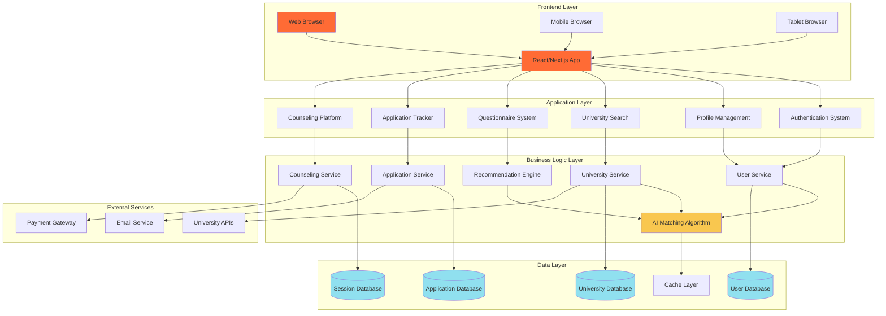
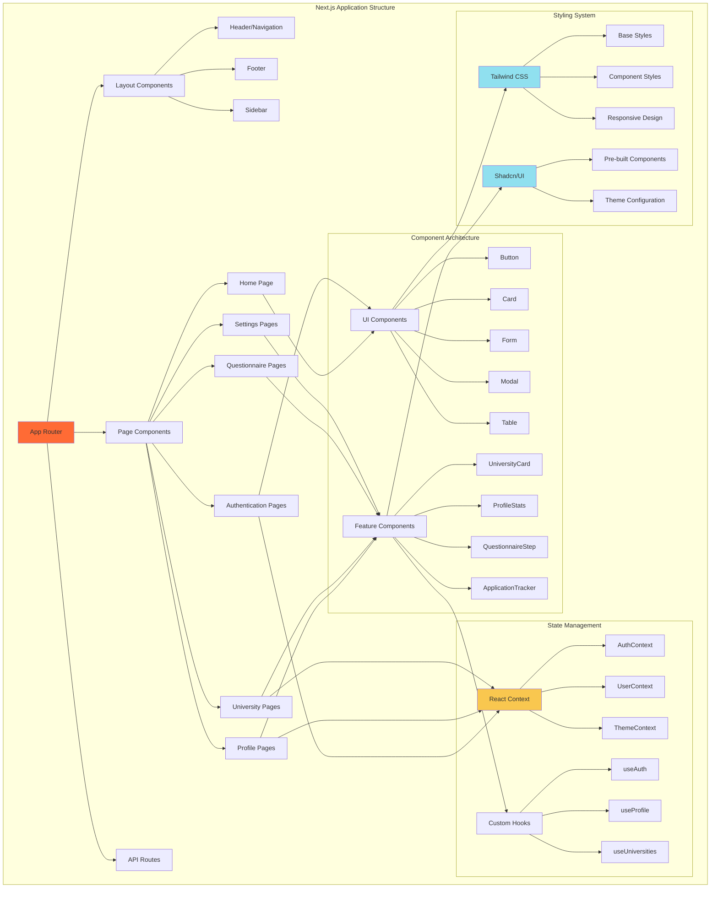
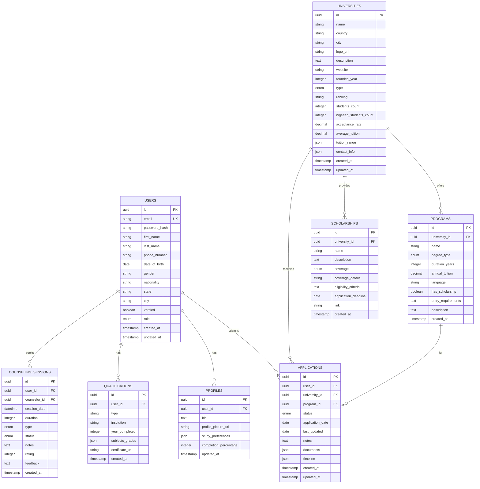
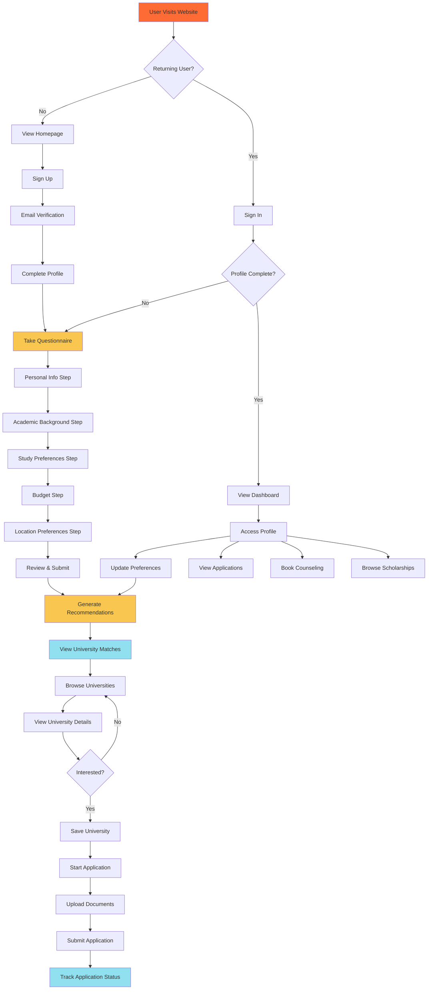
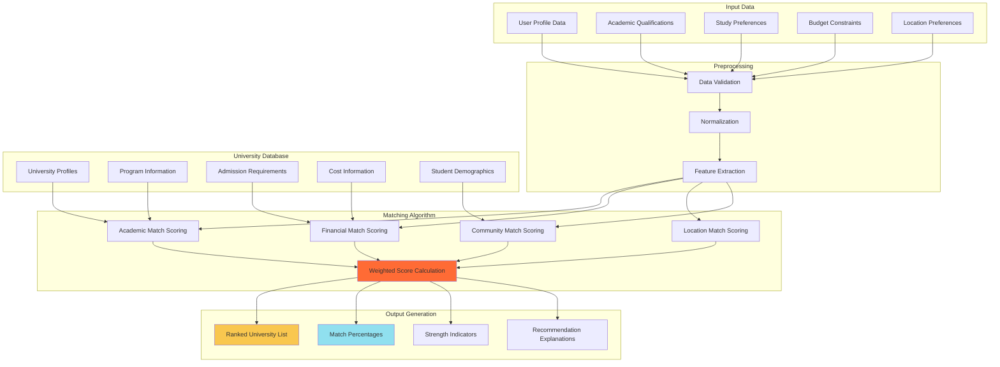
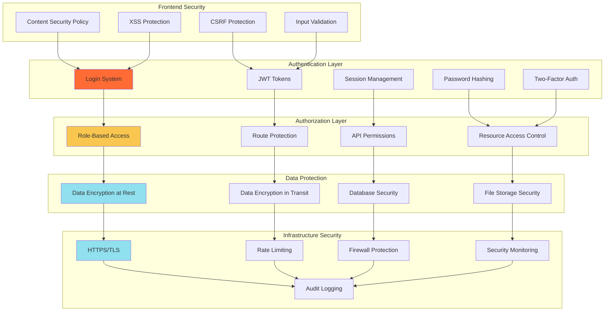
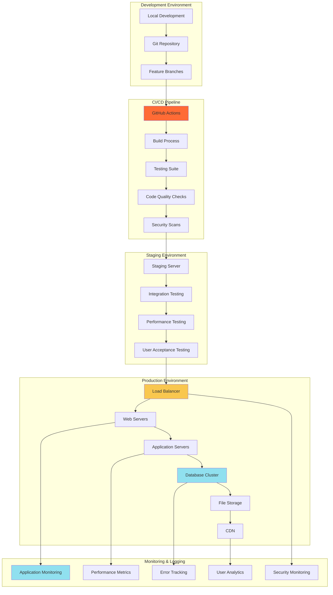

# EduConnect Africa - System Architecture Diagrams

## 1. Overall System Architecture

## 2. Frontend Architecture

## 3. Database Schema Architecture

## 4. User Journey Flow

## 5. Recommendation Engine Architecture

## 6. Security Architecture

## 7. Deployment Architecture

## Color Legend
- 🟠 **Orange (#ff6b35)**: Core System Components
- 🟡 **Yellow (#f9c74f)**: Processing/Logic Components
- 🔵 **Blue (#90e0ef)**: Data Storage/Output Components
- ⚪ **White**: Standard Components
