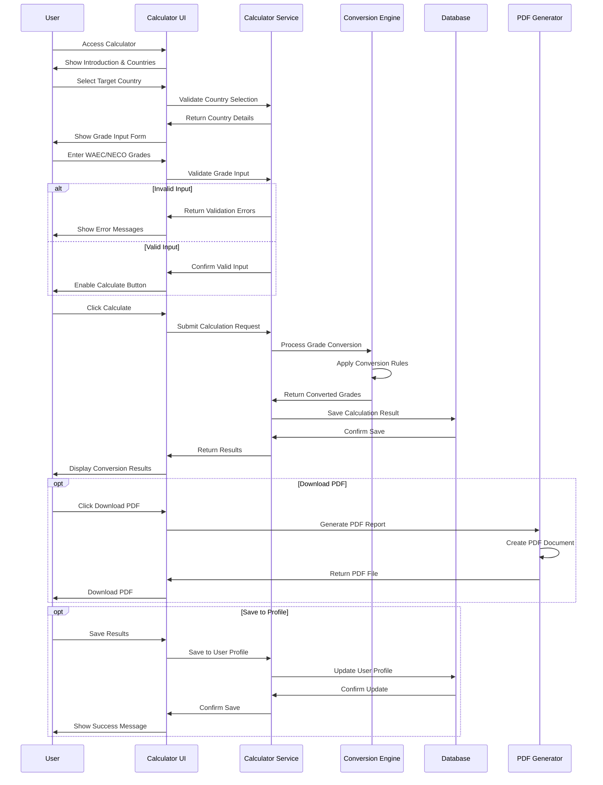
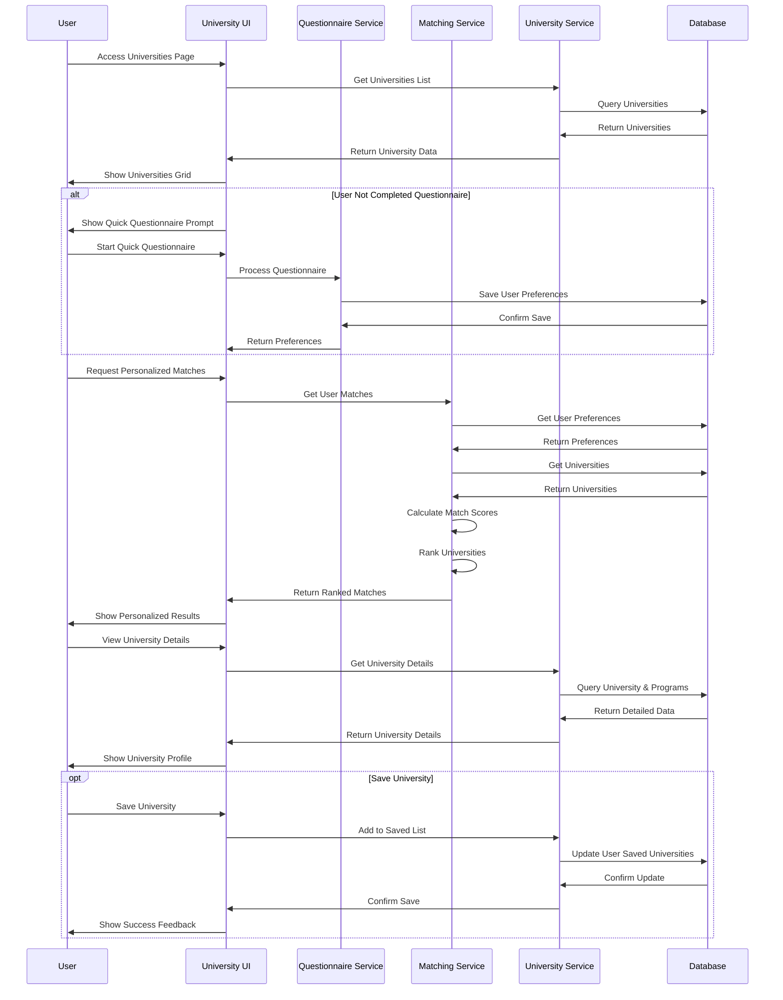
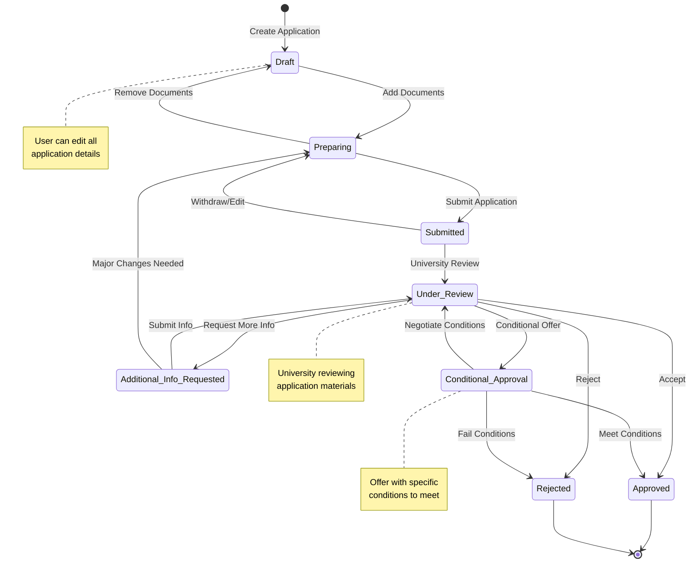
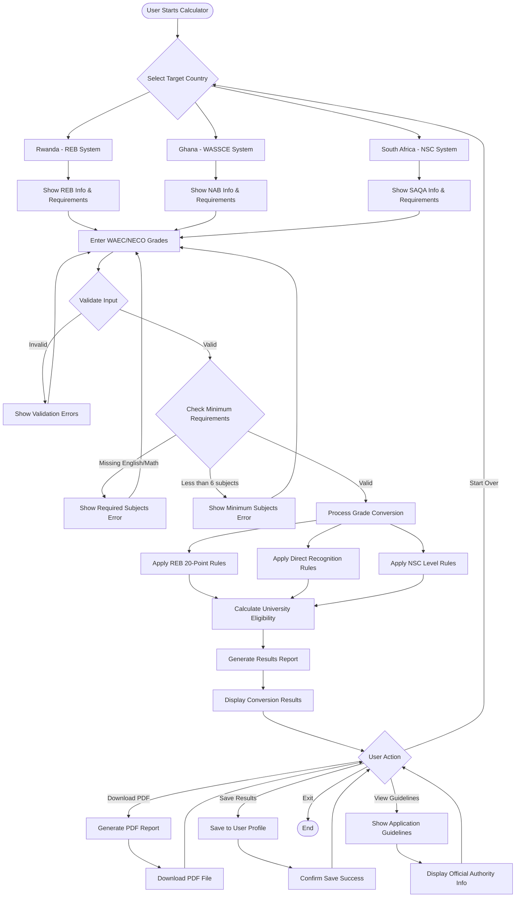

# EduConnect Africa - UML Diagrams

## 1. Class Diagram - Core Domain Models

```mermaid
classDiagram
    %% User Management
    class User {
        +string id
        +string email
        +string passwordHash
        +string firstName
        +string lastName
        +string phoneNumber
        +Date dateOfBirth
        +string gender
        +string nationality
        +string state
        +string city
        +boolean verified
        +UserRole role
        +Date createdAt
        +Date updatedAt
        +string profilePicture
        +login()
        +logout()
        +updateProfile()
        +verifyEmail()
    }

    class UserProfile {
        +string id
        +string userId
        +string bio
        +StudyPreferences studyPreferences
        +int completionPercentage
        +calculateCompletion()
        +updatePreferences()
    }

    class StudyPreferences {
        +string[] fieldsOfInterest
        +string[] preferredCountries
        +string[] preferredDegreeTypes
        +string[] preferredLanguages
        +BudgetRange budgetRange
        +string accommodationPreference
        +string startDate
        +string studyMode
        +boolean scholarshipRequired
    }

    class BudgetRange {
        +number min
        +number max
    }

    %% Academic Information
    class Qualification {
        +string id
        +string userId
        +string type
        +string institution
        +int yearCompleted
        +Subject[] subjects
        +string certificateUrl
        +Date createdAt
    }

    class Subject {
        +string subject
        +string grade
        +boolean required
    }

    class LanguageProficiency {
        +string id
        +string userId
        +string language
        +string level
        +string certification
    }

    %% University System
    class University {
        +string id
        +string name
        +string country
        +string city
        +string logoUrl
        +string description
        +string website
        +int foundedYear
        +UniversityType type
        +string ranking
        +int studentsCount
        +int nigerianStudentsCount
        +number acceptanceRate
        +number averageTuition
        +TuitionRange tuitionRange
        +ContactInfo contactInfo
        +Date createdAt
        +Date updatedAt
        +getPrograms()
        +getScholarships()
        +calculateMatch()
    }

    class Program {
        +string id
        +string universityId
        +string name
        +DegreeType degreeType
        +int durationYears
        +number annualTuition
        +string language
        +boolean hasScholarship
        +string entryRequirements
        +string description
        +Date createdAt
    }

    class Scholarship {
        +string id
        +string universityId
        +string name
        +string description
        +CoverageType coverage
        +string coverageDetails
        +string eligibilityCriteria
        +Date applicationDeadline
        +string link
        +Date createdAt
    }

    %% Application Management
    class Application {
        +string id
        +string userId
        +string universityId
        +string programId
        +ApplicationStatus status
        +Date applicationDate
        +Date lastUpdated
        +string notes
        +Document[] documents
        +Timeline[] timeline
        +Date createdAt
        +Date updatedAt
        +updateStatus()
        +addDocument()
        +getProgress()
    }

    class Document {
        +string id
        +string applicationId
        +string name
        +string type
        +string url
        +DocumentStatus status
        +Date uploadedAt
    }

    class Timeline {
        +Date date
        +string event
        +string description
        +string status
    }

    %% Counseling System
    class CounselingSession {
        +string id
        +string userId
        +string counselorId
        +DateTime sessionDate
        +int duration
        +SessionType type
        +SessionStatus status
        +string notes
        +int rating
        +string feedback
        +Date createdAt
        +scheduleSession()
        +cancelSession()
        +addFeedback()
    }

    class Counselor {
        +string id
        +string name
        +string email
        +string specialization
        +string bio
        +string profileImage
        +number rating
        +int sessionsCount
        +boolean available
        +string[] languages
        +getAvailability()
        +updateSchedule()
    }

    %% Calculator System
    class GradeCalculation {
        +string id
        +string userId
        +string country
        +string qualification
        +string year
        +GradeSubject[] subjects
        +ConversionResult result
        +Date calculatedAt
        +calculateEquivalency()
        +generateReport()
    }

    class GradeSubject {
        +string name
        +string grade
        +boolean required
        +ConvertedGrade converted
    }

    class ConvertedGrade {
        +string grade
        +string points
        +string description
        +boolean eligible
    }

    class ConversionResult {
        +int eligibleSubjects
        +boolean universityEligible
        +string country
        +ApplicationGuideline guidelines
    }

    class ApplicationGuideline {
        +string authority
        +string website
        +string email
        +string phone
        +string fee
        +string processingTime
        +string[] requirements
        +string[] process
    }

    %% Enums
    class UserRole {
        <<enumeration>>
        STUDENT
        COUNSELOR
        ADMIN
    }

    class UniversityType {
        <<enumeration>>
        PUBLIC
        PRIVATE
        TECHNICAL
        RESEARCH
    }

    class DegreeType {
        <<enumeration>>
        CERTIFICATE
        DIPLOMA
        BACHELOR
        MASTER
        PHD
    }

    class ApplicationStatus {
        <<enumeration>>
        PREPARING
        SUBMITTED
        UNDER_REVIEW
        CONDITIONAL_APPROVAL
        APPROVED
        REJECTED
    }

    class SessionType {
        <<enumeration>>
        VIDEO
        AUDIO
        CHAT
    }

    class SessionStatus {
        <<enumeration>>
        SCHEDULED
        COMPLETED
        CANCELLED
        MISSED
    }

    class DocumentStatus {
        <<enumeration>>
        REQUIRED
        UPLOADED
        APPROVED
        REJECTED
    }

    class CoverageType {
        <<enumeration>>
        FULL
        PARTIAL
        TUITION_ONLY
        LIVING_EXPENSES
    }

    %% Relationships
    User ||--|| UserProfile : has
    User ||--o{ Qualification : has
    User ||--o{ LanguageProficiency : has
    User ||--o{ Application : submits
    User ||--o{ CounselingSession : books
    User ||--o{ GradeCalculation : performs

    UserProfile ||--|| StudyPreferences : contains
    StudyPreferences ||--|| BudgetRange : has

    Qualification ||--o{ Subject : contains

    University ||--o{ Program : offers
    University ||--o{ Scholarship : provides
    University ||--o{ Application : receives

    Application ||--|| Program : for
    Application ||--o{ Document : contains
    Application ||--o{ Timeline : tracks

    CounselingSession }|--|| Counselor : with

    GradeCalculation ||--o{ GradeSubject : contains
    GradeCalculation ||--|| ConversionResult : produces
    GradeSubject ||--|| ConvertedGrade : converts
    ConversionResult ||--|| ApplicationGuideline : includes
```

## 2. Use Case Diagram - Main System Functions

```mermaid
graph TB
    %% Actors
    Student((Student))
    Counselor((Counselor))
    Admin((Admin))
    Guest((Guest User))

    %% System Boundary
    subgraph "EduConnect Africa System"
        %% Authentication Use Cases
        UC1[Register Account]
        UC2[Login/Logout]
        UC3[Verify Email]
        UC4[Reset Password]

        %% Profile Management
        UC5[Complete Profile]
        UC6[Update Personal Info]
        UC7[Add Academic Qualifications]
        UC8[Set Study Preferences]

        %% University System
        UC9[Browse Universities]
        UC10[Search Universities]
        UC11[View University Details]
        UC12[Save Universities]
        UC13[Get Personalized Matches]

        %% Grade Calculator
        UC14[Calculate Grade Equivalency]
        UC15[Select Target Country]
        UC16[Input WAEC/NECO Grades]
        UC17[View Conversion Results]
        UC18[Download Results PDF]

        %% Application Management
        UC19[Start Application]
        UC20[Upload Documents]
        UC21[Track Application Status]
        UC22[Submit Application]

        %% Counseling Services
        UC23[Browse Counselors]
        UC24[Book Counseling Session]
        UC25[Attend Session]
        UC26[Provide Feedback]

        %% Scholarship System
        UC27[Browse Scholarships]
        UC28[Filter Scholarships]
        UC29[Apply for Scholarship]

        %% Questionnaire System
        UC30[Take Questionnaire]
        UC31[Update Preferences]

        %% Admin Functions
        UC32[Manage Universities]
        UC33[Manage Users]
        UC34[View Analytics]
        UC35[Manage Content]

        %% Counselor Functions
        UC36[Manage Schedule]
        UC37[Conduct Sessions]
        UC38[View Student Profiles]
    end

    %% Student Use Cases
    Student --> UC1
    Student --> UC2
    Student --> UC5
    Student --> UC6
    Student --> UC7
    Student --> UC8
    Student --> UC9
    Student --> UC10
    Student --> UC11
    Student --> UC12
    Student --> UC13
    Student --> UC14
    Student --> UC15
    Student --> UC16
    Student --> UC17
    Student --> UC18
    Student --> UC19
    Student --> UC20
    Student --> UC21
    Student --> UC22
    Student --> UC23
    Student --> UC24
    Student --> UC25
    Student --> UC26
    Student --> UC27
    Student --> UC28
    Student --> UC29
    Student --> UC30
    Student --> UC31

    %% Guest Use Cases
    Guest --> UC1
    Guest --> UC2
    Guest --> UC9
    Guest --> UC10
    Guest --> UC11
    Guest --> UC14
    Guest --> UC15
    Guest --> UC16
    Guest --> UC17
    Guest --> UC23
    Guest --> UC27
    Guest --> UC28

    %% Counselor Use Cases
    Counselor --> UC2
    Counselor --> UC36
    Counselor --> UC37
    Counselor --> UC38

    %% Admin Use Cases
    Admin --> UC2
    Admin --> UC32
    Admin --> UC33
    Admin --> UC34
    Admin --> UC35

    %% Use Case Relationships
    UC14 ..> UC15 : includes
    UC14 ..> UC16 : includes
    UC14 ..> UC17 : includes
    UC19 ..> UC20 : includes
    UC24 ..> UC25 : extends
    UC30 ..> UC13 : triggers
```

## 3. Sequence Diagram - Grade Calculator Flow



## 4. Sequence Diagram - University Matching Flow



## 5. Component Diagram - Frontend Architecture

```mermaid
graph TB
    subgraph "Next.js Application"
        subgraph "App Router"
            AR[App Router]
            LP[Layout Provider]
            MP[Metadata Provider]
        end

        subgraph "Pages"
            HP[Home Page]
            UP[Universities Page]
            CP[Calculator Page]
            PP[Profile Page]
            SP[Settings Page]
            QP[Questionnaire Page]
            CNP[Counseling Page]
        end

        subgraph "Layout Components"
            H[Header]
            F[Footer]
            ML[Main Layout]
            SB[Sidebar]
        end

        subgraph "Feature Components"
            subgraph "University Components"
                UC[University Card]
                UF[University Filters]
                PUC[Personalized University Card]
                QQD[Quick Questionnaire Dialog]
            end

            subgraph "Calculator Components"
                CI[Calculator Intro]
                CS[Country Selection]
                GI[Grade Input]
                GR[Grade Results]
            end

            subgraph "Profile Components"
                PH[Profile Header]
                PS[Profile Stats]
                PT[Profile Tabs]
                PO[Profile Overview]
                AI[Academic Info]
                SPR[Study Preferences]
                SU[Saved Universities]
                AT[Applications Tab]
                CST[Counseling Sessions Tab]
            end

            subgraph "Settings Components"
                SH[Settings Header]
                ST[Settings Tabs]
                PSE[Personal Settings]
                AS[Academic Settings]
                PRS[Preferences Settings]
                ACS[Account Settings]
            end

            subgraph "Questionnaire Components"
                PIS[Personal Info Step]
                ABS[Academic Background Step]
                SPS[Study Preferences Step]
                BS[Budget Step]
                LPS[Location Preferences Step]
                FS[Final Step]
            end
        end

        subgraph "UI Components"
            B[Button]
            C[Card]
            I[Input]
            S[Select]
            D[Dialog]
            T[Table]
            A[Avatar]
            BD[Badge]
            AL[Alert]
            PR[Progress]
            SL[Slider]
            CB[Checkbox]
            TB[Tabs]
        end

        subgraph "Hooks & Context"
            AC[Auth Context]
            UA[useAuth Hook]
            UT[useToast Hook]
            TH[Theme Hook]
        end

        subgraph "Utils & Services"
            API[API Layer]
            MA[Matching Algorithm]
            VA[Validation Utils]
            FU[Format Utils]
        end
    end

    %% Relationships
    AR --> LP
    AR --> MP
    AR --> HP
    AR --> UP
    AR --> CP
    AR --> PP
    AR --> SP
    AR --> QP
    AR --> CNP

    LP --> ML
    ML --> H
    ML --> F

    UP --> UC
    UP --> UF
    UP --> PUC
    UP --> QQD

    CP --> CI
    CP --> CS
    CP --> GI
    CP --> GR

    PP --> PH
    PP --> PS
    PP --> PT
    PT --> PO
    PT --> AI
    PT --> SPR
    PT --> SU
    PT --> AT
    PT --> CST

    SP --> SH
    SP --> ST
    ST --> PSE
    ST --> AS
    ST --> PRS
    ST --> ACS

    QP --> PIS
    QP --> ABS
    QP --> SPS
    QP --> BS
    QP --> LPS
    QP --> FS

    %% All components use UI components
    UC --> B
    UC --> C
    UC --> BD
    GI --> I
    GI --> S
    GI --> CB
    PH --> A
    PH --> BD

    %% Context usage
    HP --> AC
    UP --> AC
    PP --> AC
    UA --> AC

    %% Services usage
    UP --> API
    UP --> MA
    CP --> API
    QP --> VA
    ALL --> FU
```



## 6. Component Diagram - Backend Architecture (Future Implementation)

```mermaid
graph TB
    subgraph "API Gateway"
        AG[API Gateway]
        AU[Authentication Middleware]
        RT[Rate Limiting]
        LO[Logging Middleware]
    end

    subgraph "Microservices"
        subgraph "User Service"
            US[User Service]
            UP[User Profile Manager]
            UQ[User Questionnaire Handler]
        end

        subgraph "University Service"
            UNS[University Service]
            US_DB[University Database]
            PS[Program Service]
            SS[Scholarship Service]
        end

        subgraph "Matching Service"
            MS[Matching Service]
            MA[Matching Algorithm]
            RS[Recommendation Service]
            SC[Scoring Calculator]
        end

        subgraph "Calculator Service"
            CS[Calculator Service]
            CE[Conversion Engine]
            RG[Rules Generator]
            PG[PDF Generator]
        end

        subgraph "Application Service"
            AS[Application Service]
            DM[Document Manager]
            TS[Tracking Service]
            NS[Notification Service]
        end

        subgraph "Counseling Service"
            CNS[Counseling Service]
            CM[Counselor Manager]
            SM[Session Manager]
            PM[Payment Manager]
        end
    end

    subgraph "Data Layer"
        subgraph "Databases"
            UDB[(User Database)]
            UNDB[(University Database)]
            ADB[(Application Database)]
            SDB[(Session Database)]
            CDB[(Calculator Database)]
        end

        subgraph "Cache Layer"
            RC[Redis Cache]
            MC[Memory Cache]
        end

        subgraph "File Storage"
            FS[File Storage]
            DS[Document Storage]
            IS[Image Storage]
        end
    end

    subgraph "External Services"
        ES[Email Service]
        SMS[SMS Service]
        PS_EXT[Payment Service]
        VS[Video Service]
        PDF_EXT[PDF Service]
    end

    %% API Gateway Connections
    AG --> AU
    AG --> RT
    AG --> LO

    %% Service Connections
    AG --> US
    AG --> UNS
    AG --> MS
    AG --> CS
    AG --> AS
    AG --> CNS

    %% User Service
    US --> UP
    US --> UQ
    US --> UDB

    %% University Service
    UNS --> US_DB
    UNS --> PS
    UNS --> SS
    UNS --> UNDB

    %% Matching Service
    MS --> MA
    MS --> RS
    MS --> SC
    MS --> RC

    %% Calculator Service
    CS --> CE
    CS --> RG
    CS --> PG
    CS --> CDB

    %% Application Service
    AS --> DM
    AS --> TS
    AS --> NS
    AS --> ADB
    AS --> FS

    %% Counseling Service
    CNS --> CM
    CNS --> SM
    CNS --> PM
    CNS --> SDB

    %% External Services
    NS --> ES
    NS --> SMS
    PM --> PS_EXT
    SM --> VS
    PG --> PDF_EXT
```



## 7. State Diagram - Application Status Flow



## 8. Activity Diagram - Grade Calculator Process



These UML diagrams provide a comprehensive view of the EduConnect Africa application architecture, covering:

1. **Class Diagram**: Core domain models and their relationships
2. **Use Case Diagram**: Main system functions for different user types
3. **Sequence Diagrams**: Detailed interaction flows for key processes
4. **Component Diagrams**: Frontend and backend architectural structure
5. **State Diagram**: Application status transitions
6. **Activity Diagram**: Grade calculator business process flow

The diagrams show how the system handles user management, university matching, grade calculation, application tracking, and counseling services in a modular, scalable architecture.
